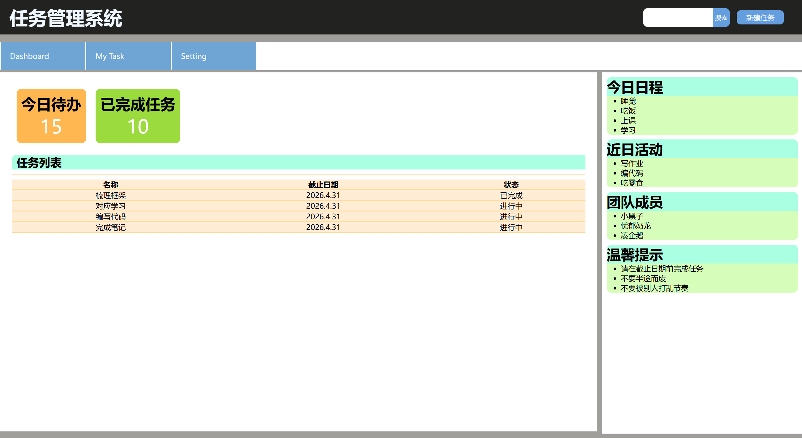
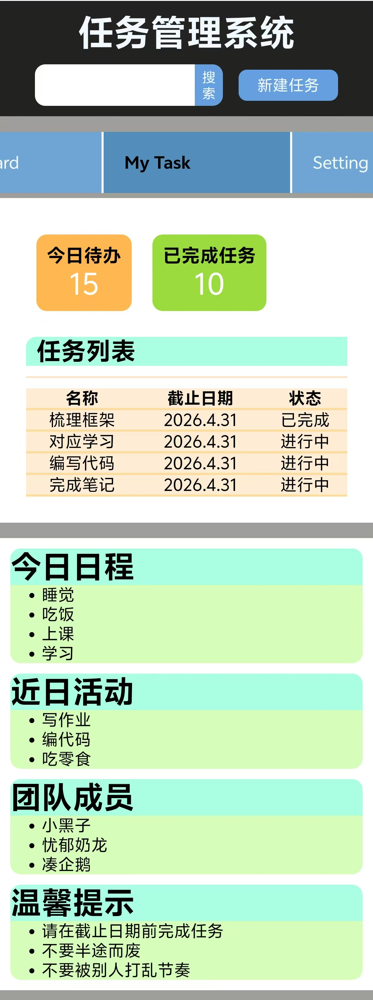

# 静态网页制作

## 项目简介

这是一个使用 HTML + CSS 完成的任务管理页面。

## 页面包含的内容

- 顶部区域
- 导航区域
- 数据卡片区
- 任务列表区
- 附加信息模块

## 我是怎么实现的

### HTML 结构

我把页面分成了这几个部分：

- header
- nav
- combine
    - container
        - card
        - list
    - extra

我主要主要使用的html元素：
- 文本类
    - h1 ~ h6：标题
    - p：段落
- 列表类
    - ul：无序列表（带圆点）
    - li：列表项
- 表格类
    - table：表格
    - tr：行
    - td：单元格
-  链接
    - a：链接
- 布局盒子
    - div：最常用的块级盒子
    - header：头部
    - nav：导航

### CSS 布局

我主要使用了：

- flex：用于 自动排版 、元素排版比例调整 和 排版方向

- border、outline等元素的背景属性以及color、font等元素的文本属性

### 响应式处理

##### 当屏幕变小时，我做了这些调整：

- 根据不同的视觉效果以及屏幕尺寸的差距，在水平和垂直方向的元素排版之间转换
- 调整文字的大小（一方面改善视觉效果，另一方面避免文字部分对其他排版的影响）

##### 与鼠标、按钮等的交互

- 主要采取 背景和文字颜色的变化 以及 鼠标样式的变化 实现交互效果
    - 按键的触碰效果
    - 导航的样式触碰、保持样式

## 页面截图

### 桌面端

### 移动端

